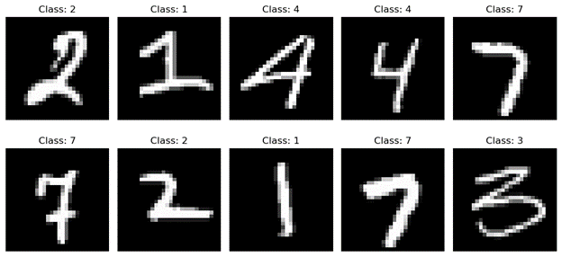

# Training Linear Neural Networks on MNIST
This repo included code to train linear neural networks on the MNIST dataset (48k train, 12k validation, 10k test). The data examples are saved in csv format with the first column being the label (which digit 0-9) and then the 784 pixel intensities (left to right, top to bottom) of the 28x28 pixel grayscale images.

